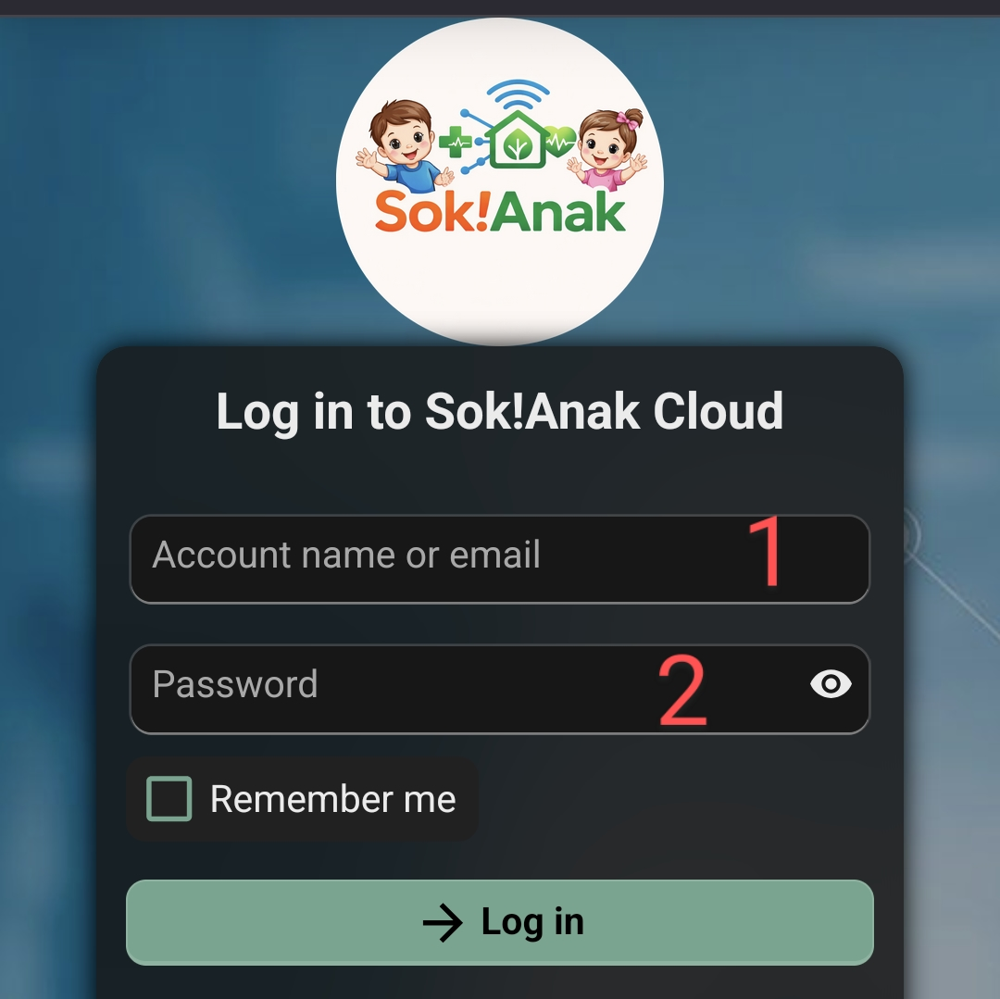
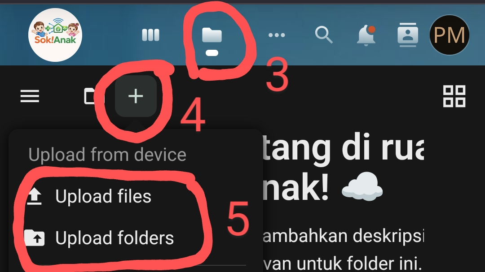

## Panduan Menggunakan Penyimpanan Sok!Anak

Berikut adalah cara mudah untuk mengunggah file ke dalam sistem:

### **1. Login ke Aplikasi**
*   Buka alamat website berikut: [https://cloud.sokanak.id](https://cloud.sokanak.id)
*   Gunakan **username** dan **password** yang sama seperti aplikasi Sok!Anak biasa.
*   Masukkan kedua informasi tersebut, lalu tekan tombol login.

    

### **2. Mengunggah File**
*   Setelah berhasil masuk, Anda dapat mengunggah berbagai jenis file seperti foto, video, dan dokumen untuk kebutuhan administrasi.
*   Cari dan klik tombol **"Upload"** untuk memilih file dari komputer atau ponsel Anda.

    