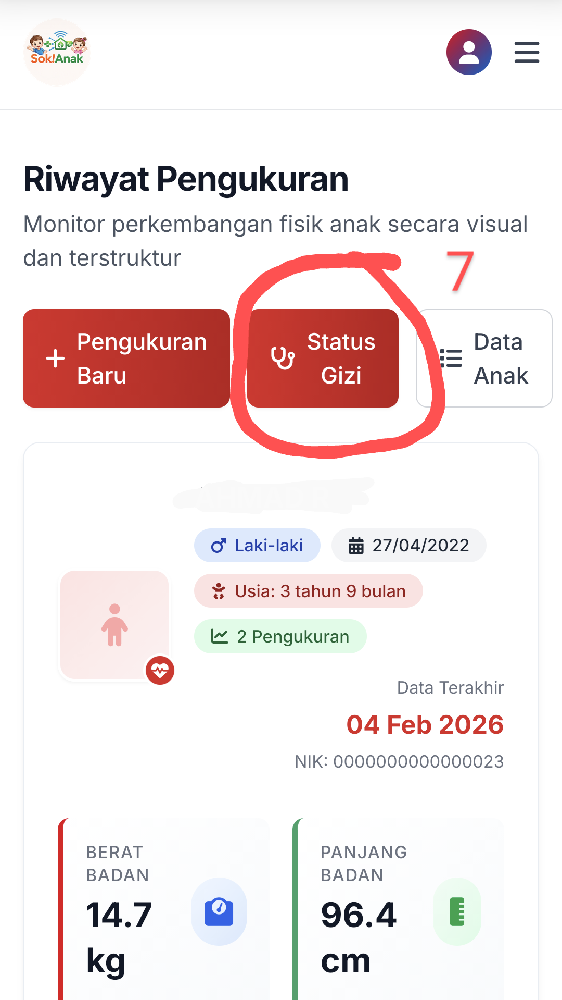

## Panduan Pengukuran Menggunakan Aplikasi Sok!Anak

Berikut langkah-langkah sederhana untuk mengukur anak dan melihat hasilnya:

### 1. Masuk ke Aplikasi
*   Buka aplikasi di alamat: [app.sokanak.id](https://app.sokanak.id)
*   Masukkan **username** dan **password** Anda.

    

### 2. Buka Menu Input Data
*   Setelah masuk, klik **ikon menu (≡)** di pojok kanan atas.
*   Pilih menu **"Input Pengukuran"**.

    

### 3. Lakukan Pengukuran
*   Pastikan alat ukur sudah siap dan anak yang akan diukur sudah ada di dekat alat.
*   Pilih **nama anak** dari daftar.
*   Klik tombol **"Sinkron Berat Badan & Panjang Badan"**. Data dari alat akan otomatis terisi.

    

### 4. Lihat Status Gizi Anak
*   Setelah data masuk, Anda akan langsung melihat riwayat pengukuran anak tersebut.
*   Klik tulisan **"Status Gizi"** untuk melihat hasilnya (misal: Normal, Kurang, dll).

    

**5. Simpan atau Analisis Hasil**
*   Anda bisa **mencetak laporan** jika diperlukan.
*   Untuk konsultasi lebih lanjut, Anda bisa **menyalin teks status gizi** dan menanyakannya ke **Asisten AI Sok!Anak** di [tanya.sokanak.id](https://tanya.sokanak.id) (gunakan username & password yang sama).

    